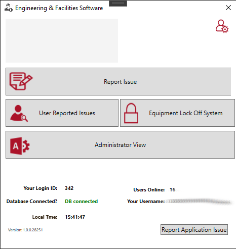
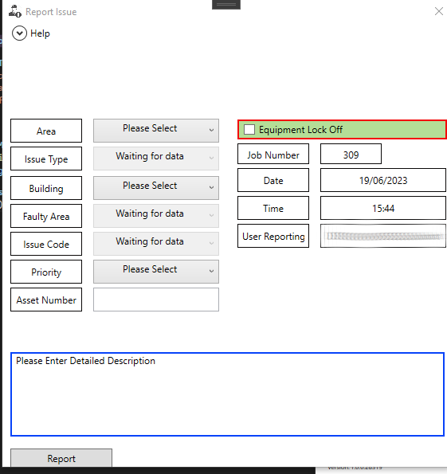
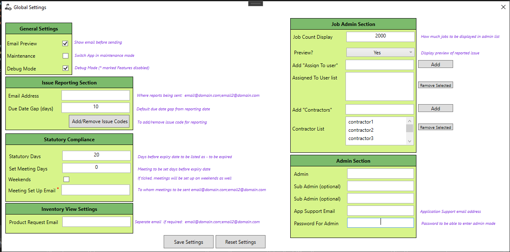
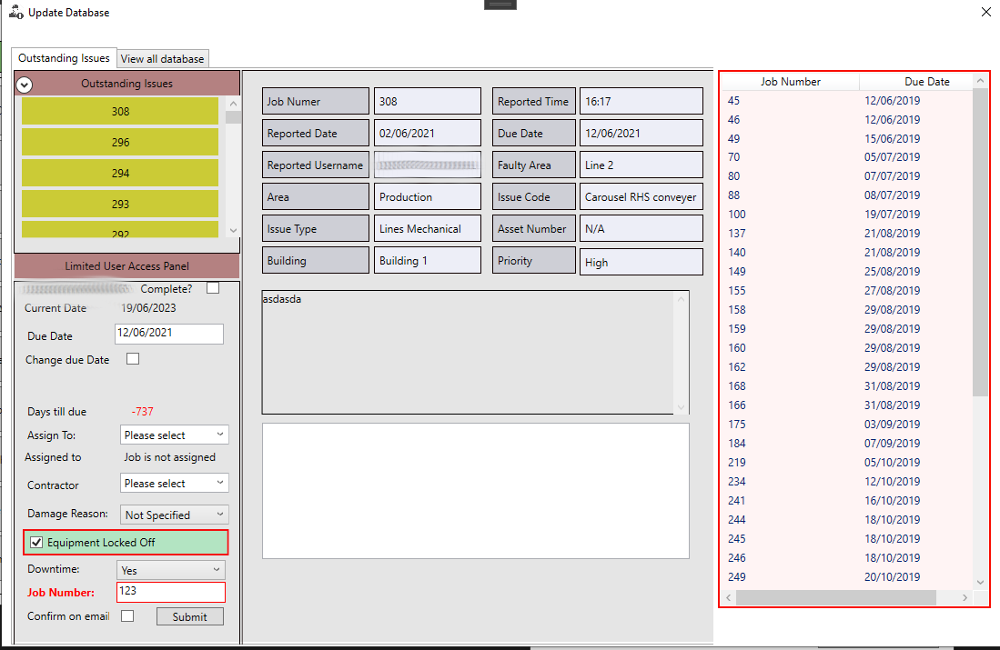

## Description

Tool was created to support Facilities Engineerign team with automatic reporting system.
Tool uses Outlook Extension to generate automatic email and to be sent out to specific email group.

Utilises Windows Authentication system to gather information about user - in this case Username

Engineering team is able to updated and report back (to user who reported) through application if task was completed and what actions was taken

## Technologies Used
- WPF
- SQL
- C#

## Screenshots

<picture>
  
</picture>

<picture>
   
</picture>

<picture>
  
</picture>

<picture>
  
</picture>

